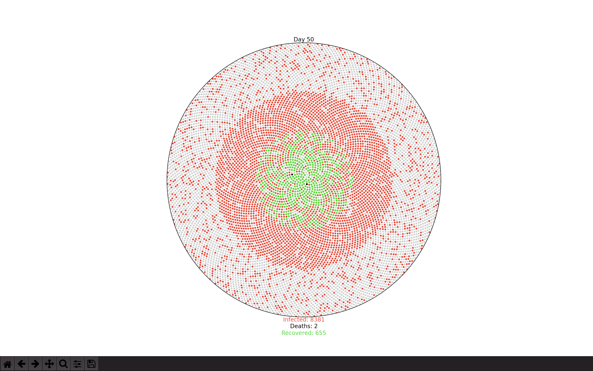

# COVID-19 Simulator

[](https://github.com/EmperorYP7/Covid-simulator/actions/workflows/python.yml)

[](/LICENSE.md)
[](https://github.com/EmperorYP7/Covid-simulator/stargazers)

This project simulates the spread of COVID-19 in a controlled set of population with colorcodes.



# How does it work?

## Variables involved

This simulation is based on the current statistics of the COVID-19 pandemic. Here are the variables used in this simulation:

- `r0` : Total number of cases generated through a single infected person

- `percent_mild` : The rate of mild cases

- `percent_severe` : The rate of severe cases,

- `fatality_rate` : The rate of deaths

- `serial_interval` : The average time between successive cases in a chain transmission

- `population` : The number of individuals in isolated population

## Cases

A person might have different duration in which the one might experience mild, severe symptoms. 
If these symptoms persist for a longer duration of time, the patient is more likely to die of the virus. 
However, if the symptoms are mild enough, one may recover from it.

But, if one is exposed to the virus, he/she will be incubated
for a certain period after which these symptoms might be severe or mild.

# How to run?

Follow these steps to see the simulation:

1. Clone this repo

1. Open a terminal/command prompt inside the repository and issue:
```bash
pip install numpy matplotlib
```

3. Now, issue this command:
```bash
python simulation.py
```
